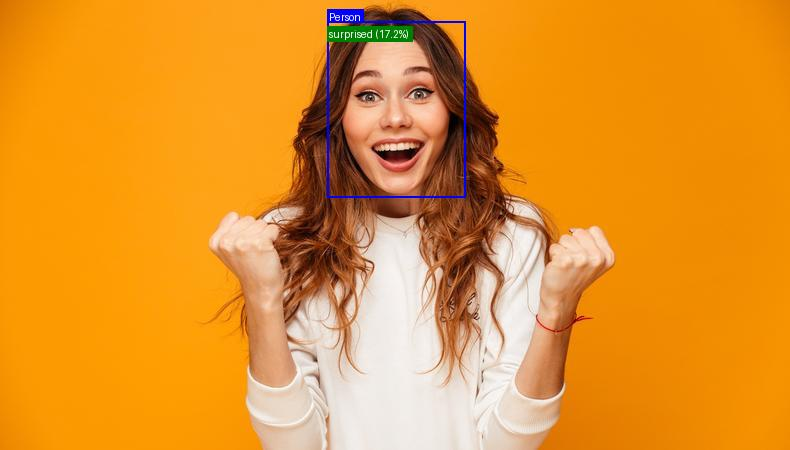
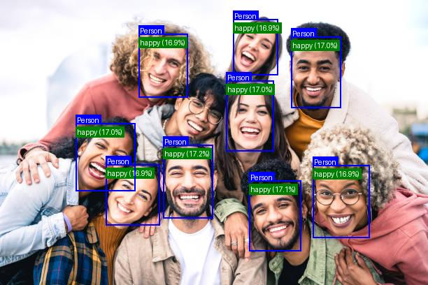
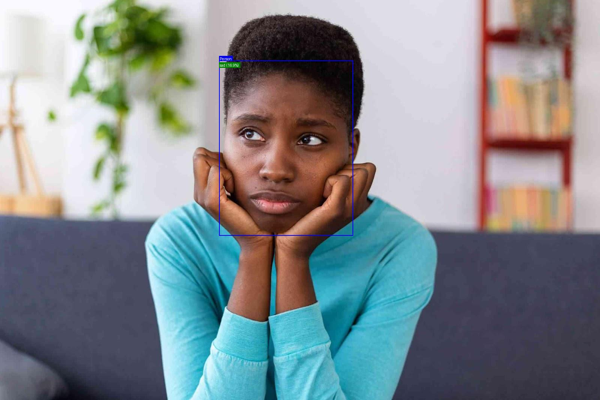

# AI-Powered Object Detection and Zero-Shot Emotion Classification

[](https://www.python.org/)
[](https://flask.palletsprojects.com/)
[](https://www.docker.com/)
[](https://opensource.org/licenses/MIT)

This project is a cutting-edge microservice that combines **YOLOv11** for real-time object detection with **OpenAI's CLIP** for zero-shot emotion classification. The system features a user-friendly web interface for image uploads and a powerful AI backend that detects individuals in images and analyzes their emotions without needing a pre-trained emotion dataset.

The entire application is containerized with Docker for easy, consistent deployment and is optimized for efficient performance even in non-GPU environments.

-----

## 💡 Example Results

Here are a few examples of the model's output.

<p align="center">
  <figure style="display:inline-block; margin:10px; text-align:center;">
    
    <figcaption>Supraised</figcaption>
  </figure>
  <figure style="display:inline-block; margin:10px; text-align:center;">
    
    <figcaption>Happy</figcaption>
  </figure>
  <figure style="display:inline-block; margin:10px; text-align:center;">
    
    <figcaption>Sad</figcaption>
  </figure>
</p>


-----

## ✨ Key Features

  * **Person Detection**: Utilizes a lightweight **YOLOv11n** model to accurately detect people in images.
  * **Zero-Shot Emotion Classification**: Employs **CLIP** to classify emotions (`happy`, `sad`, `angry`, `surprised`, etc.) without specific training data.
  * **Web Interface**: Simple and intuitive UI built with Flask for uploading images and viewing results.
  * **Optimized Performance**: Engineered to run efficiently on standard CPU hardware.
  * **Dockerized Deployment**: Includes a `Dockerfile` for quick and reproducible deployment on any system.

-----

## 🛠️ Technologies Used

  * **Backend**: Python, Flask
  * **Object Detection**: YOLOv11
  * **Emotion Classification**: OpenAI CLIP
  * **Image Processing**: Pillow (PIL)
  * **Containerization**: Docker
  * **Dataset Source**: Roboflow Universe

-----

## 📂 Project Structure

```
project/
│
├── models/
│   └── best.pt
│
├── static/
│   ├── uploads/
│   ├── results/
│   └── examples/
│
├── templates/
│   ├── index.html
│   └── result.html
│
├── app.py
├── requirements.txt
├── Dockerfile
└── README.md
```

-----

## ⚙️ How It Works

The workflow is a seamless integration between the object detection and classification models:

1.  **Image Upload**: The user uploads an image through the Flask web interface.
2.  **Person Detection**: **YOLOv11** processes the image, identifies all individuals, and draws bounding boxes around them.
3.  **Image Cropping**: Each detected person is cropped from the main image.
4.  **Emotion Classification**: The cropped images are passed to **CLIP**. CLIP compares each image against a set of text prompts (e.g., "a photo of a happy person," "a photo of a sad person") to determine the most likely emotion. This is a **zero-shot** process, meaning CLIP was not explicitly trained to recognize these emotions.
5.  **Annotation & Display**: The original image is annotated with the bounding boxes and the corresponding emotion labels. The final result is displayed to the user.

-----

## 📊 Model Performance

### Object Detection (YOLOv11)

The YOLOv11n model was trained on a Roboflow Universe dataset of over 6,500 images to identify the `person` class.

**Confusion Matrix Summary:**

  * **True Positives (Person)**: `90%` - Correctly identified 90% of people.
  * **False Negatives (Person)**: `10%` - Missed 10% of people, likely due to occlusion or difficult lighting.
  * **True Negatives (Background)**: `100%` - Correctly identified all background areas.
  * **False Positives (Person)**: `0%` - The model never incorrectly classified a background area as a person.

The model is highly reliable at confirming the presence of a person, though it can be conservative and miss some instances in challenging conditions.

### Emotion Classification (CLIP)

CLIP's zero-shot capability was leveraged to classify emotions without an emotion-specific dataset. This was achieved by:

1.  **Defining Emotion Labels**: A set of target emotions was defined: `happy`, `sad`, `angry`, `fearful`, `disgusted`, and `surprised`.
2.  **Generating Text Prompts**: For each label, descriptive text prompts were created (e.g., `"a photo of a person who is happy"`).
3.  **Calculating Similarity**: CLIP calculates the similarity between the cropped image of a person's face and each text prompt, assigning the emotion with the highest score.

-----

## 🚀 Getting Started

You can run this project easily using Docker.

### Prerequisites

  * [Docker](https://www.google.com/search?q=https://www.docker.com/get-started) installed on your machine.
  * [Git](https://git-scm.com/downloads) for cloning the repository.

### Installation & Run

1.  **Clone the repository:**

    ```bash
    git clone https://github.com/your-username/your-repo-name.git
    cd your-repo-name
    ```

2.  **Build the Docker image:**

    ```bash
    docker build -t object-emotion-app .
    ```

3.  **Run the Docker container:**

    ```bash
    docker run -d -p 1412:1412 object-emotion-app
    ```

4.  **Access the application:**
    Open your web browser and navigate to **http://localhost:1412**. You can now upload an image and see the magic happen\!

-----

## Challenges and Learnings

  * **Model Integration**: Combining the distinct architectures of YOLOv11 and CLIP required a carefully designed pipeline to ensure data flowed smoothly between them.
  * **Zero-Shot Prompt Engineering**: Fine-tuning the text prompts for CLIP was crucial to achieving accurate and generalized emotion classification across diverse images.
  * **Performance Optimization**: Making the models run efficiently on a CPU involved selecting lightweight architectures and optimizing the processing code.

-----

## License

This project is licensed under the MIT License. See the `LICENSE` file for details.